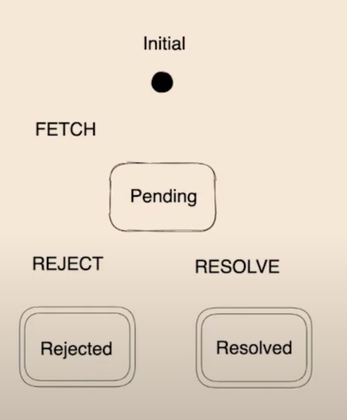

# 3월 25일

- UI의 상태를 관리하는 방법

## UI의 상태를 관리하는 방법

### 개요

UI의 상태를 관리하다가 보면 UI의 상태가 정말 복잡하다는 것을 알 수 있습니다.  
가볍게 정리해보자면,

- 액션의 수많은 사전조건
- 대부분의 상태변경에 붙는 사이드 이펙트
- DB, 캐시, 쿠키 등 다양한 맥락에 의존
- 한 상태로부터 파생되는 다른 상태들
- 상태의 의존성을 추적하고 동기화하는데 많이 드는 비용

이 있습니다.  
여기서 사이드 이펙트란, 원래 목적에 맞지 않게 진행되는 것 즉 버그(오류)를 뜻합니다.

#### Bottom up 방식의 단점

개발자들은 주로 큰 기능을 여러 작은 조각으로 나누고, 그 작은 조각들을 차근차근 처리해오는 연습을 했을 것입니다.  
이러한 방식을 Bottom up 방식이라고 칭하는데 상태관리를 할 때 이런 Bottom up 방식은 문제가 될 수 있습니다.

먼저, UI는 매번 생각보다 복잡해집니다. 매번 모든 상태를 완벽히 파악하고 대처할 수 있다면 좋겠지만 그건 매우 어려운 일입니다.  
또한 Bottom up 방식으로 조금씩 차근차근하다보면 기존 코드에 다른 코드가 쌓이고 또 쌓여 결국에는 코드를 이해하기 어려워집니다.  
즉 작은 것부터 차근차근 하기 때문에 선형적으로 복잡해지는 것이죠.

### 해결 방법

그렇다면 이런 복잡한 UI 상태를 관리하기 위해서는 어떻게 해야할까요?  
이 번에 소개할 방법은 상태머신과 상태차트입니다.

1. Finite state machine(FSM - 유한 상태 기계)

이름에서부터 뭔가 유한적일 것 같지 않나요? 줄여서 FSM로도 불리우는 상태 머신은,

- 항상 단일 초기 상태
- 유한한 개수의 이벤트
- 유한한 개수의 상태
- 이벤트에 의해 다음 상태 전환

이라는 특징을 가지고 있습니다.



무언가 사진이 익숙하지 않으신가요? 맞습니다. 이 사진은 promise의 사진입니다.  
어? 왜 갑자기 promise? 라고 할 수 있겠지만 언급한 데에는 이유가 있습니다.  
네 맞아요 promise는 상태 머신의 한 종류입니다.  
Javascript 개발자라면 정말 유용하게 쓸 promise가 상태 머신이라니 신기하지 않나요?  
이런 promise를 보면 상태와 이벤트가 만나 나음 상태와 사이드 이펙트가 나온다는 것을 추측할 수 있습니다.  
state + event -> nextstate + side_effects라는 것이죠.

여기서 의문!  
promise는 많이 들어봐도 상태 머신은 그만큼 자주 안 들어봤을 것 같습니다.  
이 이유가 뭘까요?

바로 상태머신을 잘 안 쓰기 때문인데요, 이 이유를 알아보자면 애자일 방법론에서 비롯됩니다.  
애자일 방법론에선느 필요하지 않은 것을 미리 하지 말라는 이론이 있습니다.  
상태 머신을 써도 추후에 수정될 가능성이 있고, 게다가 필요할 때 쓰면 이미 늦은 타이밍일 수 있기 때문이죠.

하지만 우리는 써보고 생각해봅시다.

### 상태 머신은 어떻게 쓰는 걸까?

1. 상태머신의 형태에 대해서 알아봅시다.


대충 이렇게 생겼습니다. ~~복잡해보이는 것 같은데 간소화한 겁니다~~  
설명을 하자면, 초기상태가 있고 값이 들어오면 invlid상태가 됩니다.  
이후에 값을 판단한 뒤 pending register가 되고 실패와 성공 여부를 체크해 성공이라면 완료됩니다.

이제 코딩으로 짜볼까요?

```js
type state {
  Inital
  Invalid
  Vlid
  PendingREgister
  HasError
  Registerd
};

type action {
  ChangeInput
  Submit
  RegistraionSucceed
  RegistraionFailed
};
```

이렇게 타입이 있는 언어에서 쉽게 정의할 수 있습니다.  
오직 위의 사진을 옮겨온 거라는 사실!!

이제 state와 action을 이용하여 마저 코딩해봅시다.

```js
let reducer = (state, action) => switch (state, action) {
  (Initial | Valid(_) | Invalid(_), ChangeInput(input)) => {
    switch (PhoneNumber.make(input)) {
      Some(number) => Invalid(number)
      None => Invalid(input)
    }
  }
  (Valid(number) , Submit(_)) => PendiingRegister
  (PendingRegister(_), RegistraionSucceed) => Registerd
  (PendingRegister(_), RegistraionFailed) => HasError
  (HasError, Retry) => PendingRegister
  => state
};
```

이렇게 코딩할 수 있는데, 일반적으로 switch-case 중첩 또는 패턴매칭을 활용해서 구현합니다.  
위의 패턴은 react를 쓰는 사람들은 알겠지만 리듀서라는 패턴을 이용해서 구현한 모습입니다.

이제 사이드 이펙트까지 넣어보겠습니다.

```js
let (state, dispatch) = React.useReducer(reducer, Initial);

React.useEffect1(() => {
  switch (state) {
    PendingRegister(number) => {
      let%Result result = Api.register(number);
      switch (result) {
        Ok(_) => dispatch(RegistraionSucceed)
        Error(_) => dispatch(RegistraionFailed)
      }
    }
    _ => ()
  }
}, (state));
```

이렇게 코딩을 해놓으면 어떻게 호출을 하든 예상을 벗어나는 일은 없을 겁니다.  
즉 제한한 상태로부터 동작을 예상 가능하게 바꾸는 것이죠.  
이제 새로운 상태를 넣기 위해 코드를 수정하지 않는 겁니다.

\*참고 : setstate, usestate보다는 리듀서를 쓰자!

### 그런데

그래도 일어나는 문제들이 있습니다.

1. happy-path Design

사람은 완벽하지 않기 때문에 코딩보다는 테스트나, 버그 잡는 시간이 오래 걸립니다.

2. state explosion (상태 폭발)

'상태폭발' 이란?

- 설계할 때 빼먹은 상태
- 기능추가
- 엣지 케이스 대응

등을 하는 상황에서, 즉 기존의 상태머신에 새로운 상태를 추가할 때, 모델링 해야 하는 상태간의 연결 개수가 폭발적으로 증가하는 현상을 이릅니다.

예를 들면...


이라거나


라거나...


이라거나... 하는 상황이 있죠.

앗! Boolean Flag와 다른 게 뭐냐고요?  
Boolean Flag와 유용함에는 차이가 없지만 유지보수는 상태머신이 더 어렵습니다.  
이유는  
Boolean Flag는 만들어놓고 안 쓸 수 있지만 상태가 서로 연결된 상태머신은 그럴 수 없어 수정만이 답이기 때문이죠.
